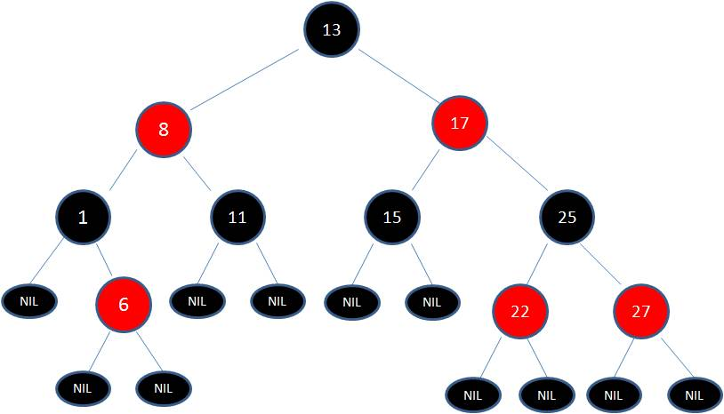

非线性结构：

树：

树由节点和弧组成。

根在顶部，叶子(末端节点)在底部。

根是一个没有父节点只有子节点的节点，而叶节点没有子节点或者子节点是空结构。
一颗树中非叶子节点我们称之为非终端节点，包括根节点。

每个节点都可以从根节点经一个唯一的弧序列到达，此弧序列被称之为路径，路径中弧的数量称之为路径的长度。

节点的层次是从根节点到该节点的路径的长度加 1，也就是该路径上节点的数量。

树的高度(深度)是树中节点的最大层次。空结构是空树，所以空树高度为 0。只有一个根节点的树的高度是 1。

在一棵树中，如果某个节点拥有 n 个子节点，那么我们称该节点的度为 n。

树在极端情况下可以退化为链表，这种树的高度为唯一叶节点的层次。

---

二叉树：二叉树是节点可以包含最多两个子节点的树，每一个子节点都区分左子节点或右子节点。

- 完美二叉树：在一棵二叉树中，如果每个非终端节点都有两个子节点，并且所有叶子节点位于同一层次，那么称之为完美二叉树（Perfect Binary Tree）。

  完美二叉树左右子树是完美对称的，具有以下特性：

  1. 第 i+1 层的节点数为 2^i
  2. 如果完美二叉树高度为 n，那么总的节点数为 2^n - 1
  3. 如果完美二叉树中叶子节点为 m，非终端节点为 k，那么 m=k+1
  4. 如果完美二叉树中某节点下标为 n，那么它的左节点下标为 2n+1，右节点下标为 2n+2

  

- 完全二叉树：在一颗二叉树中，若除最后一层外的其余层都是满的，并且最后一层要么是满的，要么在右边缺少连续若干节点，则此二叉树为完全二叉树（Complete Binary Tree）。
  参考：https://zh.wikipedia.org/wiki/%E4%BA%8C%E5%8F%89%E6%A0%91#%E5%AE%8C%E7%BE%8E%E4%BA%8C%E5%8F%89%E6%A0%91 https://www.cnblogs.com/idorax/p/6441043.html

- 完满二叉树：在一棵二叉树中，只存在度为 0 或者 2 的节点，称该树为完满二叉树（Full/Strictly Binary Tree）。换句话说，所有非叶子结点的度都是 2。（只要你有孩子，你就必然是有两个孩子。）

在所有二叉树中存在一个重要的性质：

> _如果其叶子结点(度为 0)数为 m, 度为 2 的结点数为 n, 则 m = n + 1。_

- 二叉查找树（Binary Search Tree），也称为 二叉搜索树、有序二叉树（Ordered Binary Tree）或排序二叉树（Sorted Binary Tree），是指一棵空树或者具有下列性质的二叉树：

  1. 若任意节点的左子树不空，则左子树上所有节点的值均小于它的根节点的值；
  2. 若任意节点的右子树不空，则右子树上所有节点的值均大于它的根节点的值；
  3. 任意节点的左、右子树也分别为二叉查找树；
  4. 没有键值相等的节点。

  对于一个二叉查找树，常规操作有插入，查找，删除，找父节点，求最大值，求最小值。
  

---

##### 平衡树是计算机科学中的一类数据结构，是一种改进的二叉查找树。

一般的二叉查找树的查询复杂度取决于目标结点到树根的距离（即深度），因此当结点的深度普遍较大时，查询的均摊复杂度会上升。为了实现更高效的查询，产生了平衡树。

- 平衡二叉树（Balanced Binary Tree）又称 AVL 树 (Adelson-Velsky and Landis Tree - AVL Tree): 是最早被发明的自平衡二叉查找树。
  它是一棵空树或它的左右两个子树的高度差的绝对值不超过 1，并且左右两个子树都是一棵平衡二叉树。
  AVL 树是高度平衡的二叉树。它的特点是：AVL 树中任何节点的两个子树的高度最大差别为 1。 通常 AVL 树是在二叉搜索树上，经过局部调整而建立的，因此，它还是一棵排序树。
  
  上面的两张图片，左边的是 AVL 树，它的任何节点的两个子树的高度差别都<=1；而右边的不是 AVL 树，因为 7 的两颗子树的高度相差为 2(以 2 为根节点的树的高度是 3，而以 8 为根节点的树的高度是 1)。
  参考 ：https://blog.csdn.net/wangxiaotongfan/article/details/51516430

  ###### AVL 树的旋转，插入，删除：

  - 旋转：如果在 AVL 树中进行插入或删除节点后，可能导致 AVL 树失去平衡。这种失去平衡的可以概括为 4 种姿态：LL(左左)，LR(左右)，RR(右右)和 RL(右左)。 参考： https://blog.csdn.net/wangxiaotongfan/article/details/51516430

- 红黑树（Red Black Tree）：是一种自平衡的二叉查找树，除了符合二叉查找树的基本特性外，它还具有下列的附加特性：

  1. 节点是红色或黑色。
  2. 根节点是黑色。
  3. 每个叶子节点都是黑色的空节点（NIL 节点）。
  4. 每个红色节点的两个子节点都是黑色。(从每个叶子到根的所有路径上不能有两个连续的红色节点)
  5. 从任一节点到其每个叶子的所有路径都包含相同数目的黑色节点。
     

- 2-3 树
- B 树，参考：https://segmentfault.com/a/1190000020416577

---

字典树
