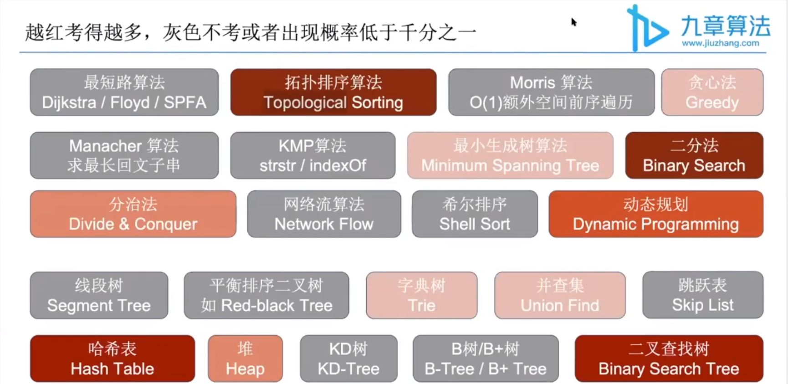
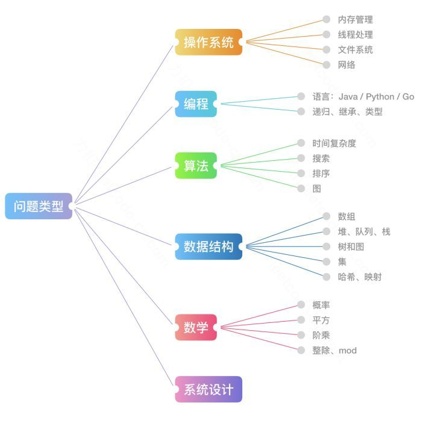

#### 概括：

- [概括面试中优先掌握的算法，数据结构](#方向)
- [github 上 leetcode 的 repository 和电子书, 基本的算法和数据结构](#电子书)

###### 方向:

颜色越红，表示面试中碰到的概率越高，越要优先掌握的算法和数据结构；灰色的基本不考，这部分可以先放一放。

算法： 拓扑排序算法，贪心算法，最小生成树算法，二分法，分治法，动态规划，二叉查找树

数据结构：哈希表，堆，字典树，并查集

---

###### 电子书：

https://leetcode-solution-leetcode-pp.gitbook.io/leetcode-solution/

这里有一张互联网公司面试中经常考察的问题类型总结的思维导图，我们可以结合图片中的信息分析一下。

其中算法，主要是以下几种：

- 基础技巧：分治、二分、贪心
- 排序算法：快速排序、归并排序、计数排序
- 搜索算法：回溯、递归、深度优先遍历，广度优先遍历，二叉搜索树等
- 图论：最短路径、最小生成树
- 动态规划：背包问题、最长子序列

数据结构：

- 数组与链表：单 / 双向链表
- 栈与队列
- 哈希表
- 堆：最大堆 ／ 最小堆
- 树与图：最近公共祖先、并查集
- 字符串：前缀树（字典树） ／ 后缀树
