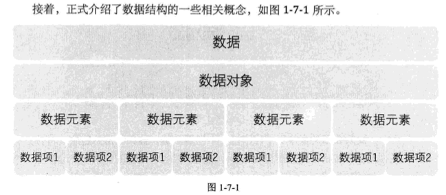

### 第一章-数据结构绪论

###### 1.4 基本概念和术语

- 1.4.3 数据项
  数据项是数据不可分割的最小单位，但真正讨论问题时，数据元素才是数据结构中建立数据模型的着眼点。
- 1.4.5 数据结构
  数据结构：是相互之间存在一种或多种特定关系的数据元素的集合。

###### 1.5 逻辑结构与物理结构

- 1.5.1 逻辑结构
  集合结构，线性结构，树形结构，图形结构。

- 1.5.2 物理结构（存储结构）
  顺序存储结构，链式存储结构

###### 1.6 抽象数据类型

- 1.6.2 抽象数据类型
  ADT： 指一个数学模型及定义在该模型上的一组操作。

###### 1.7 回顾总结

