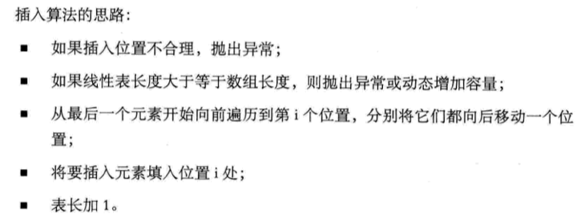
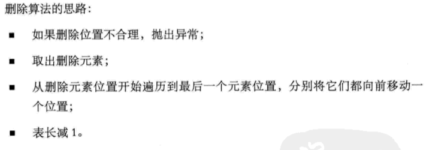

### 第三章-线性表

###### 3.2 线性表的定义

线性表（List）：零个或者多个具有 相同类型 的 数据元素 的有限 序列。

###### 3.3 线性表的抽象数据类型

实现两个线性表集合 A 和 B 的并集操作：就是把存在集合 B 中但并不存在 A 中的数据元素插入到 A 中即可。

###### 3.4 线性表的顺序存储结构

- 3.4.3 数组长度与线性表长度区别
  数组长度是存放线性表的存储空间的长度，存储分配后这个量是一般不变的。
  线性表的长度是线性表中数据元素的个数，随着线性表的插入和删除操作的进行，这个量是变化的。
- 3.4.4 地址计算方法
  我们对每个线性表位置的存入或者取出数据，对于计算机来说都是相等的时间，存取时间性能为*O(1)*。

###### 3.5 顺序存储结构的插入与删除

- 3.5.1 获得元素操作
  若将线性表 L 中的第 i 个位置元素值返回，只要 i 的数值在数组下标范围内，就是把数组第 i-1 下标的值返回即可。
- 3.5.2 插入操作
  
- 3.5.3 删除操作
  

> 线性表的顺序存储结构，在存、读数据时，时间复杂度都是*O(1)*;
> 而在插入或者删除时，时间复杂度都是*O(n)*。
> 它比较适合元素个数不太变化，而更多是存取数据的应用。

- 3.5.4 线性表顺序存储结构的优缺点

###### 3.6 线性表的链式存储结构

- 3.6.2 线性表链式存储结构定义
  线性表的链式存储结构的特点是用一组任意的存储单元，存储线性表的数据元素，这组存储单元可以是连续的也可以是不连续的。
  以前在顺序结构中，每个数据元素只需存数据元素信息就可以了。现在在链式结构中，除了要存数据元素信息外，还要存储它的后继元素的存储地址。
- 3.6.3 头指针与头结点的异同
- 3.6.4 线性表链式存储结构代码描述

###### 3.7 单链表的读取

> 获得链表第 i 个数据的算法思路。

其主要核心思想就是“工作指针后移”。
最坏情况的时间复杂度是*O(n)*。
由于单链表的结构中没有定义表长，所以不能事先知道要循环多少次，因此也就不方便使用 for 来控制循环。

###### 3.8 单链表的插入与删除

- 3.8.1 单链表的插入
  s->next = p->next; p->next=s; 这两句的顺序不可以交换。

  > 单链表第 i 个数据插入结点的算法思路。

- 3.8.2 单链表的删除
  q = p->next; p->next = q->next
  > 单链表第 i 个数据删除结点的算法思路。

单链表插入和删除算法，其实都是由两部分组成：第一部分就是遍历查找第 i 个元素；第二部分就是插入和删除元素。
对于插入或删除数据越频繁的操作，单链表的效率优势就越是明显。

###### 3.9 单链表的整表创建

> 单链表整表创建的算法思路。 头插法、尾插法。

###### 3.10 单链表的整表删除

> 单链表整表删除的算法思路。

###### 3.11 单链表结构与顺序存储结构优缺点

###### 3.13 循环链表

将单链表中，终端结点的指针端由空指针改为指向头结点，就使整个单链表形成一个环，这种头尾相接的单链表称为单循环链表，简称循环链表(circular linked list)。
循环链表解决了一个很麻烦的问题：如何从当中一个结点出发，访问到链表的全部结点。

终端结点用尾指针 rear 指示，则查找终端结点是*O(1)*，而开始结点，其实就是 rear->next->next，其时间复杂度也是*O(1)*。

###### 3.14 双向链表(double linked list)

双向链表是在单链表的每个结点中，再设置一个指向其前驱结点的指针域。

p->next->prior = p = p->prior->next

双链表在插入和删除时，需要更改两个指针变量

- 插入操作并不复杂，不过顺序很重要，不能写反了
  现在假设存储元素 e 的结点为 s，要实现将结点 s 插入到结点 p 和 p->next 之间需要：
  s->prior = p;
  s->next = p->next;
  p->next->prior = s;
  p->next = s;
  > 顺序是先搞定 s 的前驱和后继，再搞定后结点的前驱，最后解决前结点的后继。
- 删除操作
  p->prior->next = p->next;
  p->next->prior = p->prior;
  free(p);

###### 3.15 回顾总结
