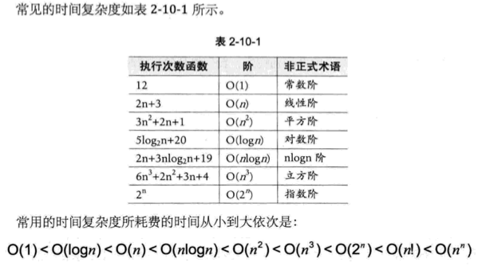

### 第二章-算法

###### 2.4 算法定义

算法是解决特定问题求解步骤的描述，在计算机中表现为指令的有限序列，并且每条指令表示一个或多个操作。

###### 2.5 算法的特性

输入，输出，有穷性，确定性，可行性。

###### 2.7 算法效率的度量方法

- 2.7.2 事前分析估算方法
  不计那些循环索引的递增和循环终止条件、变量声明、打印结果等操作，最终，在分析程序的运行时间时，最重要的是把程序看成算法或者一系列步骤。

  在分析一个算法的运行时间时，重要的是把基本操作的数量与输入规模关联起来，即基本操作的数量必须表示成输入规模的函数。

###### 2.9 算法时间复杂度

- 2.9.1 算法时间复杂度定义

- 2.9.2 推导大 O 阶方法

###### 2.10 常见的时间复杂度

###### 2.12 算法空间复杂度

###### 2.13 总结回顾
